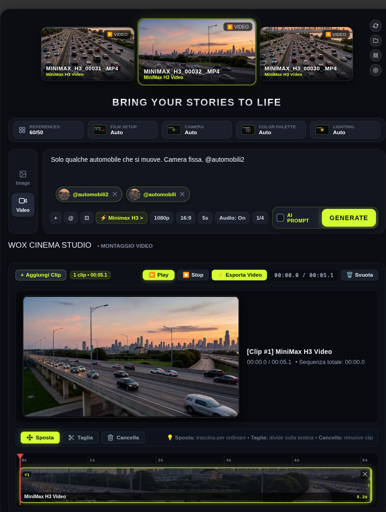
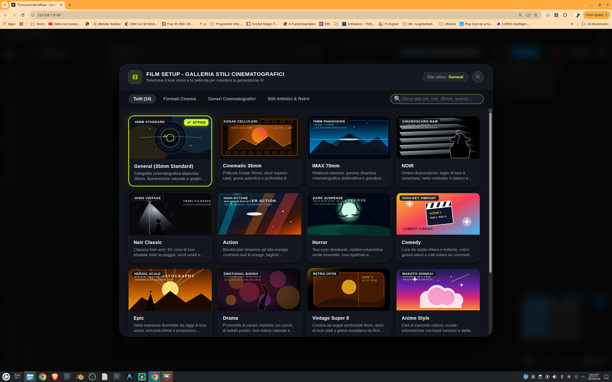
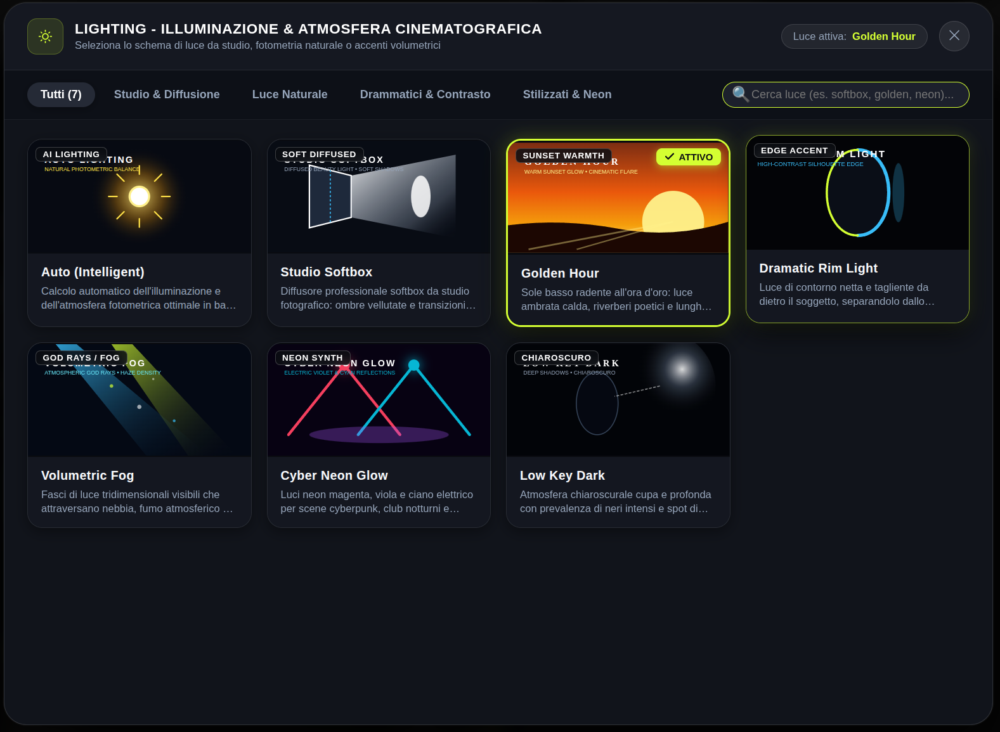
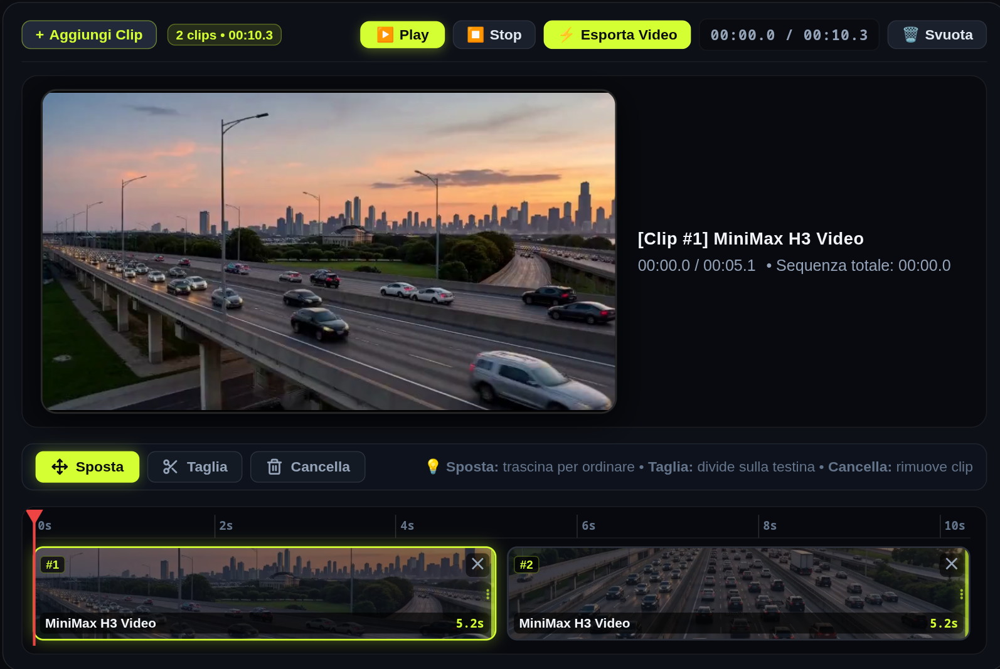
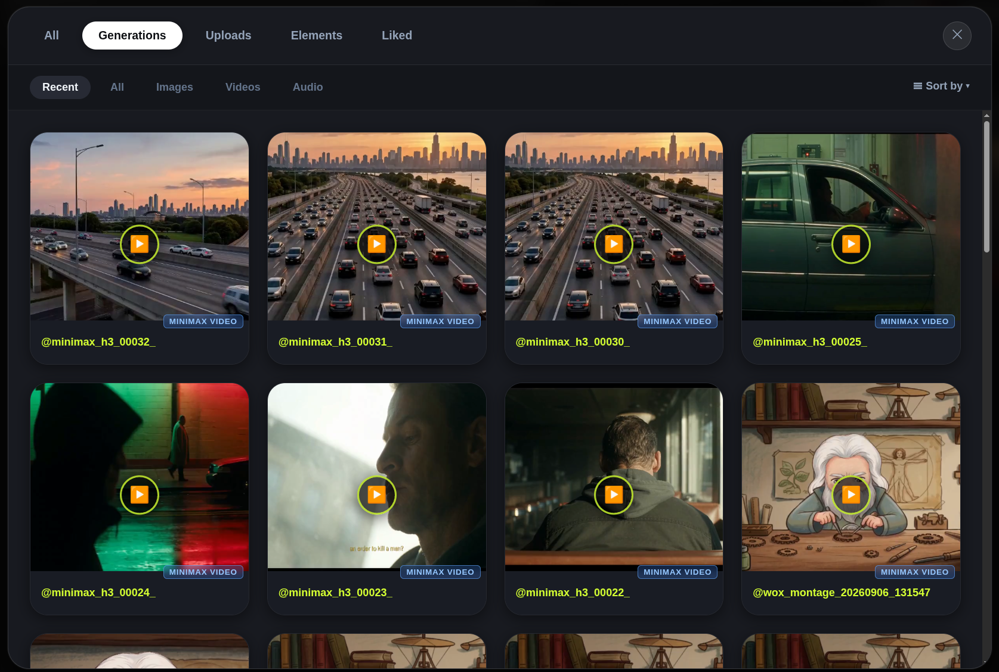
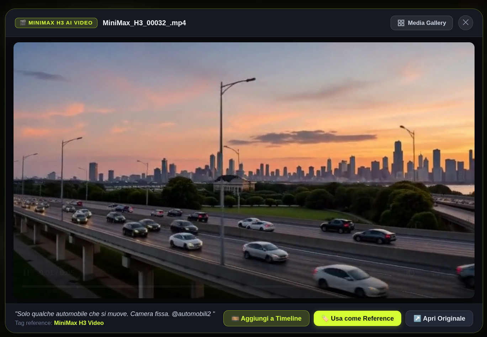
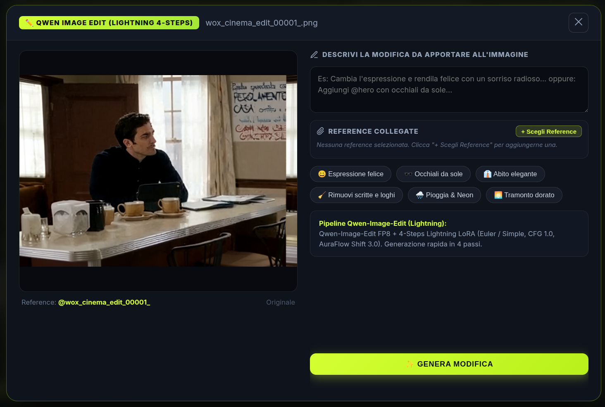
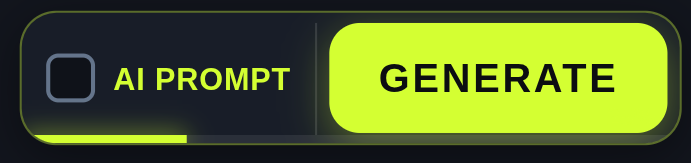

# 🎬 WOX Cinema Studio per ComfyUI

**Lingua / Language**: [🇮🇹 Versione Italiana](DOCUMENTAZIONE.md) | [🇬🇧 English Version](DOCUMENTATION.md)

---

Benvenuto nella documentazione ufficiale di **WOX Cinema Studio**, il nodo di nuova generazione per ComfyUI ideato per portare l'intera esperienza di regia, generazione e post-produzione cinematografica AI direttamente dentro al canvas di ComfyUI.

Ispirato alla celebre piattaforma **Higgsfield AI**, **WOX Cinema Studio** permette di ottenere una resa visiva, stilistica e qualitativa **quasi 1 a 1 con Higgsfield**, unendo controlli cinefili, un potente **motore di montaggio video interno con timeline**, un **Multimedia Manager / Gallery completo** e il supporto integrato per la generazione video e immagine ad altissima fedeltà.

---

## 📌 Indice dei Contenuti
1. [Cos'è WOX Cinema Studio](#-cosè-wox-cinema-studio)
2. [Ispirazione Higgsfield & Resa Cinematografica 1:1](#-ispirazione-higgsfield--resa-cinematografica-11)
3. [Motori AI Utilizzati & Architettura Locale (16GB VRAM)](#-motori-ai-utilizzati--architettura-locale-16gb-vram)
4. [Caratteristiche Principali](#-caratteristiche-principali)
5. [Guida all'Interfaccia e alle Funzionalità](#-guida-allinterfaccia-e-alle-funzionalità)
   - [Pannello di Regia & Controlli Cinefili](#pannello-di-regia--controlli-cinefili)
   - [Montaggio Video Interno (Timeline Sequencer)](#montaggio-video-interno-timeline-sequencer)
   - [Multimedia Manager & Asset Gallery](#multimedia-manager--asset-gallery)
   - [Top 3 Video Carousel & Drag and Drop](#top-3-video-carousel--drag-and-drop)
   - [Qwen Image Edit UNET (FP8): Modifica Immagini via Prompt](#qwen-image-edit-unet-fp8-modifica-immagini-via-prompt)
   - [Pannello Impostazioni & Auto-Installer Integrato (Icona Ingranaggio)](#pannello-impostazioni--auto-installer-integrato-icona-ingranaggio)
6. [Guida all'Installazione Semplificata](#-guida-allinstallazione-semplificata)
7. [Ingressi, Parametri e Uscite del Nodo](#-ingressi-parametri-e-uscite-del-nodo)

---

## 🌟 Cos'è WOX Cinema Studio

**WOX Cinema Studio** non è un semplice nodo di passaggio prompt: è una vera e propria **suite di produzione cinematografica all-in-one** incorporata come Custom Node in ComfyUI. 

Elimina la complessità e la frammentazione dei grafi complessi, racchiudendo in un'interfaccia scura, ergonomica e rifinita tutto ciò che serve per passare dall'idea scritta al cortometraggio montato: stili, schemi di luce, movimenti di macchina, reference a tag, correzioni di immagine e montaggio video con timeline.



---

## 🎯 Ispirazione Higgsfield & Resa Cinematografica 1:1

WOX Cinema Studio nasce prendendo a modello l'esperienza e l'estetica di **Higgsfield AI**:
- **Prompting Cinematografico Strutturato**: La sintassi visiva e la formattazione dei prompt emulano il comportamento dei registi virtuali Higgsfield, iniettando descrittori di pellicola 35mm Kodak reale, profondità di campo, aloni organici, grana celluloid e profili colore analogici.
- **Risultati Visivi Quasi 1 a 1**: Grazie all'impiego sinergico di modelli avanzati (**Minimax H3** e **Z-Image Turbo**) uniti ai preset visuali, si ottengono movimenti di camera stabili e coerenti, texture della pelle naturali, luci volumetriche e una consistenza temporale identica alle migliori generazioni di Higgsfield.
- **Interfaccia Dark con Pulsanti Fluo & Pill Controls**: Il look scuro arricchito da icone monocromatiche e pulsanti pill interattivi con feedback visivo immediato garantisce un'esperienza di creazione fluida, reattiva e gratificante.

---

## ⚡ Motori AI Utilizzati & Architettura Locale (16GB VRAM)

Tutto il sistema è concepito per **funzionare completamente in locale** su computer dotati di scheda video consumer con **16 GB di VRAM** (ad esempio GPU NVIDIA RTX serie 40/30 con 16GB), senza dipendere obbligatoriamente da abbonamenti cloud:

### 1. 🎥 MINIMAX H3 (Generazione Video)
- Impiegato per la **generazione video cinematografica** fotorealistica sia da prompt puro (*Text-to-Video*) sia guidata da reference (*Image-to-Video*).
- I modelli UNET e CLIP ottimizzati (come *MiniMax H3 FL2VA / Ref2VA INT8/FP8*) e il Text Encoder ad alta capacità permettono di generare sequenze fluide, cinematografiche e ricche di dettagli dinamici in 16GB di VRAM.

### 2. 🖼️ Z-IMAGE (Generazione Immagini)
- Il motore ultra-veloce ad alta definizione per la **generazione di immagini e fotogrammi chiave** cinematografici.
- Basato su pipeline ottimizzata con UNET FP8 e VAE a 16 canali, genera immagini in pochi secondi con nitidezza straordinaria e colori vivi.

### 3. 🎨 QWEN IMAGE EDIT UNET (FP8) (Modifica Immagini via Prompt)
- Modello all'avanguardia per l'**editing contestuale e la modifica delle immagini in modalità prompt naturale**.
- Grazie all'architettura **UNET FP8** accoppiata con il Text/Vision Encoder (*Qwen 2.5 VL 7B FP8*) e l'acceleratore *Lightning 4-Steps LoRA*, puoi descrivere a parole cosa cambiare (es. *"cambia l'espressione in un sorriso radioso"*, *"metti gli occhiali da sole"*, *"trasforma l'illuminazione in tramonto dorato"*) ottenendo la modifica in appena **4 passi di inferenza** con consumo di VRAM estremamente ridotto.

---

## 🚀 Caratteristiche Principali

| Caratteristica | Descrizione |
| :--- | :--- |
| **Nodo ComfyUI Integrato** | Funziona nativamente all'interno del grafo ComfyUI, dialogando con nodi di visualizzazione, salvataggio e modelli downstream. |
| **Esecuzione 100% Locale** | Tutto gira sulla propria scheda grafica con **16GB di VRAM** grazie alle quantizzazioni FP8/INT8. |
| **Auto-Installer Integrato (⚙️)** | Cliccando sull'**icona ingranaggio**, un wizard automatico verifica, scarica e installa nodi, librerie e modelli mancanti. |
| **MINIMAX H3 & Z-IMAGE** | Il binomio definitivo per video cinematografici e immagini ad altissima definizione. |
| **Qwen Image Edit UNET (FP8)** | Modifica guidata dal testo delle immagini in 4 passi ultrarapidi. |
| **Montaggio Video Interno (Timeline)** | Timeline multitraccia/sequencer per tagliare, riordinare, visualizzare ed esportare il video finale senza uscire da ComfyUI. |
| **Multimedia Manager & Gallery** | Archivio completo per sfogliare, filtrare e riutilizzare generazioni, video, immagini e audio. |
| **Top 3 Video Carousel** | Barra superiore con gli ultimi tre video generati sempre a portata di mano, con player integrato e Drag & Drop. |
| **Drag & Drop Diretto** | Trascina i video o i frame direttamente dalla card verso altri nodi ComfyUI o sul desktop. |
| **Reference System (@tags)** | Collega immagini e video di riferimento con il comodo sistema a tag `@nome_riferimento` nel prompt. |

---

## 🎬 Guida all'Interfaccia e alle Funzionalità

### Pannello di Regia & Controlli Cinefili

WOX Cinema Studio mette a disposizione 4 categorie di impostazioni cinematografiche accessibili tramite pulsanti interattivi con anteprime visuali:

1. **Film Setup (Pellicole & Generi)**:
   - *General (35mm Standard)*, *Cinematic 35mm (Kodak Celluloid)*, *IMAX 70mm*, *NOIR & Noir Classic*, *High-Octane Action*, *Horror*, *Comedy*, *Epic*, *Drama*, *Vintage Super 8*, *Anime Style*.
   
   

2. **Lighting (Illuminazione da Studio & Naturale)**:
   - *Studio Softbox*, *Golden Hour*, *Dramatic Rim Light*, *Volumetric Fog*, *Cyber Neon Glow*, *Low Key Dark*, *Auto (Intelligent)*.
   
   

3. **Camera Motion**:
   - *Pan Left/Right*, *Tilt Up/Down*, *Slow Zoom In*, *Drone FPV*, *360 Orbit*, *Static Tripod*, *Handheld Shake*.

4. **Color Palette**:
   - *Teal & Orange*, *Neon Rain at Midnight*, *Cyberpunk Neon*, *B&W Monochrome*, *Warm Sunset*, *Cool Moonlight*, *Pastel Aesthetic*.

---

### Montaggio Video Interno (Timeline Sequencer)

La sezione **WOX CINEMA STUDIO • MONTAGGIO VIDEO** trasforma il nodo in una vera e propria postazione NLE (Non-Linear Editor):

- **Aggiunta Clip Facilitata**: Clicca su `+ Aggiungi Clip` per selezionare i video generati dal catalogo o caricare file dal disco.
- **Taglio e Riorganizzazione (Trim & Cut)**:
  - Posiziona la testina temporale rossa e usa il pulsante **Taglia** per dividere la sequenza.
  - Usa la modalità **Sposta** per riordinare le clip sulla timeline tramite trascinamento.
  - Rimuovi porzioni non desiderate con **Cancella**.
- **Player di Anteprima**: Monitor ad alta definizione con controlli di **Play**, **Stop**, indicatore del timecode `00:00.0 / Sequenza Totale` e anteprima fluida.
- **Esportazione Diretta (⚡ Esporta Video)**:
  - Concatena le clip tagliate e le unisce tramite motore interno FFmpeg in un video MP4 master salvato direttamente nella cartella `output/video`.




---

### Multimedia Manager & Asset Gallery

Il pulsante a griglia in alto a destra apre il **Media Manager** completo:

- **Filtri Rapidi**: Seleziona tra *Generations*, *Uploads*, *Elements*, *Liked*.
- **Filtro Tipologia**: Mostra solo *Images*, *Videos* o *Audio*.
- **Ispezione Clip**: Cliccando su qualsiasi elemento si accede alla vista di dettaglio con riproduzione immediata, prompt originale associato e pulsanti dedicati:
  - `Aggiungi a Timeline`: Inserisce la clip al montaggio in corso.
  - `Usa come Reference`: Imposta la clip come guida visiva `@tag`.
  - `Apri Originale`: Apre il file sorgente a piena risoluzione.





---

### Top 3 Video Carousel & Drag and Drop

Sopra al campo di testo del prompt è sempre visibile la galleria rapida con gli ultimi 3 video generati:
- Thumbnail animate con anteprima video immediata.
- Nome file e modello utilizzato (es. *MiniMax H3 Video*).
- **Drag & Drop completo**: Puoi afferrare con il mouse qualsiasi video e trascinarlo direttamente nel canvas di ComfyUI (ad esempio su un nodo *Load Video* o *VHS Video Combine*) oppure sul desktop del computer.
- Icone veloci per **Refresh** della lista e **Apertura cartella output**.

---

### Qwen Image Edit UNET (FP8): Modifica Immagini via Prompt

WOX Cinema Studio integra una finestra specializzata per modificare immagini usando descrizioni in linguaggio naturale:
- **Descrivi la Modifica**: Digita nel box testuale cosa cambiare (es. *"aggiungi occhiali da sole scuri"*, *"rimuovi scritte e loghi sullo sfondo"*, *"rendi l'atmosfera notturna con luci neon"*).
- **Pill di Suggerimento Rapido**: Pulsanti con preset frequenti (*Espressione felice*, *Occhiali da sole*, *Abito elegante*, *Rimuovi scritte e loghi*, *Pioggia & Neon*, *Tramonto dorato*).
- **Collegamento Reference Multiple**: Possibilità di aggiungere immagini di stile o elementi specifici con `+ Scegli Reference`.
- **Esecuzione Lightning 4-Steps**: Elaborazione quasi istantanea guidata dalla UNET FP8 in soli 4 step di campionamento.



---

### ⚙️ Pannello Impostazioni & Auto-Installer Integrato (Icona Ingranaggio)

Per eliminare ogni difficoltà tecnica legata a dipendenze mancanti o download manuali di modelli complessi:

1. Clicca sull'**icona ingranaggio (⚙️)** posizionata in alto a destra nel nodo WOX Cinema Studio.
2. Si apre il pannello dello **Stato di Sistema e Gestione Modelli**.
3. Il sistema controlla automaticamente lo stato di tutti i componenti:
   - **Nodi ComfyUI richiesti**: *ComfyUI-VideoHelperSuite*, *ComfyUI-KJNodes*, *ComfyUI-Manager*.
   - **Moduli Python**: *requests*, *aiohttp*, *imageio*, *imageio-ffmpeg*, *Pillow*.
   - **Modelli e UNET AI**:
     - *MiniMax H3 Video UNET (INT8)*, *CLIP Qwen3-VL 32B* e *Video VAE*.
     - *Z-Image Turbo UNET (FP8)*, *Qwen 3 4B Text Encoder* e *AE VAE*.
     - *Qwen Image Edit UNET (FP8)*, *Qwen 2.5 VL 7B Encoder* e *Lightning 4-Steps LoRA*.
4. **Auto-Installer con 1 Clic**: Se uno o più componenti non sono installati, basta premere il pulsante di installazione automatica. L'installer scarica i modelli da HuggingFace nelle giuste cartelle (`diffusion_models`, `text_encoders`, `vae`, `loras`) e compila i moduli con barra di avanzamento e log in tempo reale.

---

## 📦 Guida all'Installazione Semplificata

L'installazione di WOX Cinema Studio richiede pochissimi passaggi:

### Passo 1: Scompattare lo ZIP
Prendi il file compresso `ComfyUI-WOX-Cinema-Studio.zip` ed estraine il contenuto.

### Passo 2: Copia nella cartella Custom Nodes
Copia o sposta la cartella estratta `ComfyUI-WOX-Cinema-Studio` all'interno della cartella `custom_nodes` della tua installazione di ComfyUI:
```bash
ComfyUI/custom_nodes/ComfyUI-WOX-Cinema-Studio/
```

### Passo 3: Avvia ComfyUI e Cerca il Nodo
1. Avvia (o riavvia) ComfyUI.
2. Fai **doppio clic** in un punto vuoto del canvas (oppure premi la barra `Spazio` o fai clic destro -> *Add Node*).
3. Nella barra di ricerca digita:
   ```text
   WOX CINEMA STUDIO
   ```
4. Seleziona il nodo: **🎬 WOX CINEMA STUDIO (Z-Image Turbo & Minimax H3)**.
5. Clicca sull'**icona ingranaggio (⚙️)** per verificare o scaricare automaticamente i modelli tramite l'auto-installer.



---

## 🔌 Ingressi, Parametri e Uscite del Nodo

### Ingressi Principali (Widgets & Opzioni)
- **`prompt`**: Descrizione testuale della scena cinematografica.
- **`mode`**: Scelta tra `Video (Minimax H3)`, `Image (Z-Image Turbo)` e `Image (Krea 2)`.
- **`film_setup`**: Scelta stile e pellicola (*General, 35mm, IMAX, Noir, Horror, Action, ecc.*).
- **`camera`**: Movimenti di macchina (*Auto, Static, Pan, Tilt, Zoom, Drone, 360 Orbit, Handheld*).
- **`color_palette`**: Tonalità colore cinematografica (*Teal & Orange, Cyberpunk, Noir, Sunset, ecc.*).
- **`lighting`**: Schema di luce scenica (*Softbox, Golden Hour, Rim Light, Volumetric Fog, ecc.*).
- **`aspect_ratio`**: Formato video/immagine (`16:9`, `9:16`, `1:1`, `21:9`, `4:3`).
- **`resolution`**: Risoluzione di rendering (`1080p`, `720p`, `480p`, `4k`).
- **`duration`**: Durata del video generato (`5s` o `10s`).
- **`audio`**: Generazione audio ambientale/colonna sonora (`On` / `Off`).
- **`variations`**: Numero di generazioni simultanee (`1`, `2`, `4`).
- **`reference_image` (opzionale)**: Immagine guida in ingresso dal canvas per modalità image-to-video o reference.

### Uscite (Outputs)
- **`IMAGE`**: Restituisce il fotogramma principale o l'immagine renderizzata (compatibile con i nodi nativi *Preview Image* o *Save Image*).
- **`VIDEO_FILENAMES`**: Percorso del file MP4 generato o del video esportato dalla timeline (compatibile con i nodi *VHS Video Combine* o lettori video ComfyUI).
- **`PROMPT_OUT`**: Prompt arricchito con tutte le definizioni cinefile compilate per utilizzi a valle nel grafo.

---

## 🏆 Risultati Visivi Cinematografici

L'unione dei formati anamorfici, della grana organica simulata e della qualità di rendering locale permette di ottenere fotogrammi e sequenze di livello produttivo professionale.


---

*Realizzato per registi, animatori, digital artist e creatori che desiderano il pieno controllo cinematografico professionale in ComfyUI, 100% in locale su 16GB di VRAM.*
